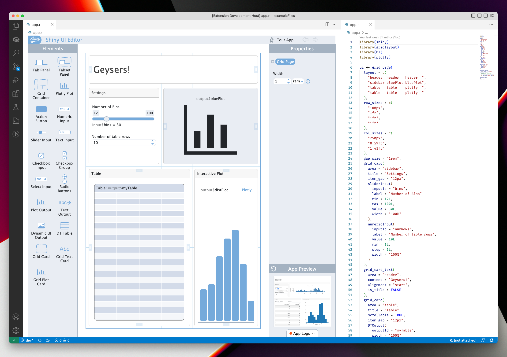

# ShinyUiEditor VSCode extension

This folder contains the workspace for the VSCode extension version of the ui editor. The webview front-end code is contained in `../inst/vscode-extension-client`.

The root level VSCode launch task `Run Extension` will bundle both the backend and client on startup using the `yarn dev` command for both.

To get side by side view you will need to open the same file twice and select one to open in `shinyuieditor` and one in `Text editor` (right click on the file tab and select "Reopen editor with" option).
